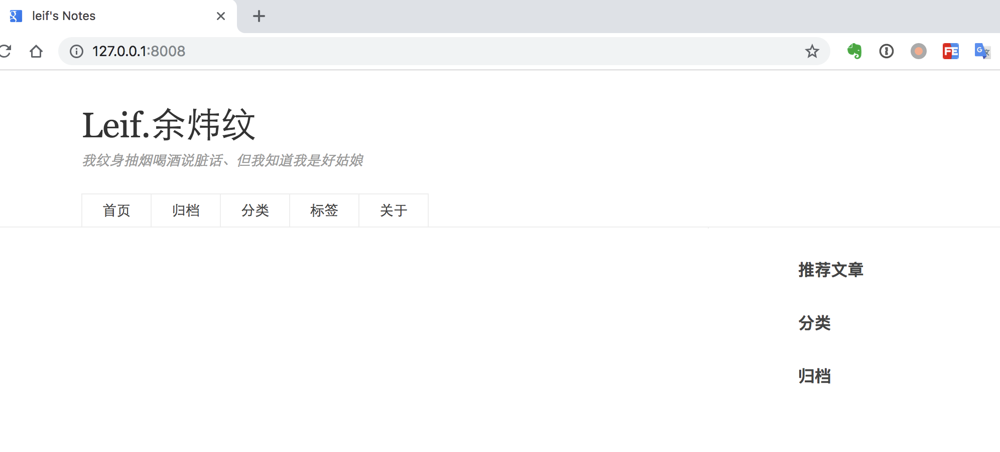

## 快速使用

> 基于`python3.6` 和 `Django`

1. 本地安装`git`、`docker`和`docker-compose`。
2. `clone`项目：
   ```
   git clone git@github.com:yuleicc/leif.im.git
   ```
3. 启动：
   ```
   docker-compose build
   docker-compose up
   docker ps
   docker exec -it xxxx /bin/bash
   python manage.py runserver
   ```
4. 创建数据库

   ```
   python manage.py makemigrations blog
   python manage.py sqlmigrate blog 0001
   python manage.py makemigrations
   python manage.py migrate
   ```

5. 创建超级用户

   ```
   ./manage.py createsuperuser
   ```

6. docker 里面暴露了 8008 端口，所以在浏览器中访问 `http://127.0.0.1:8008/`，会看到类似如下的输出：


